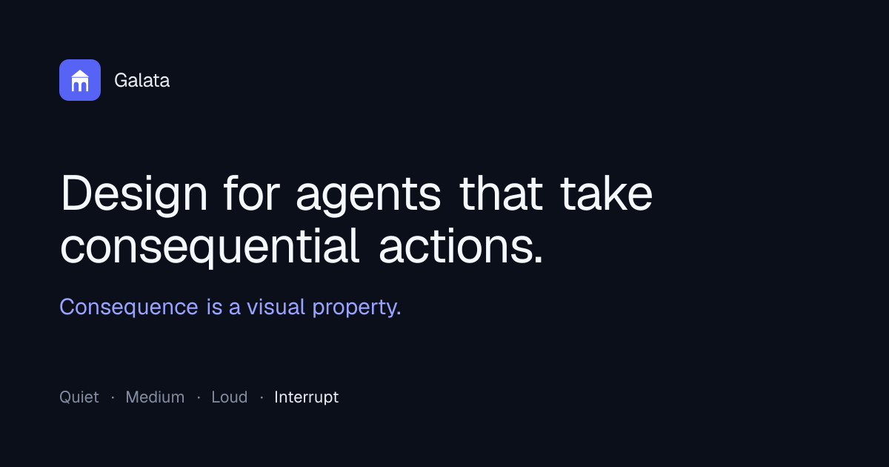

# Galata

A design system for AI agents that take **consequential actions**: moving money, sending messages, changing systems. Most agent UI kits are built for chat; Galata is built for the moment an agent *acts*, when the interface is the last thing between intent and an irreversible outcome.

> Early and built in the open. The foundations are here; the component set is filling in. Stars and watches are the best way to follow along.

## The idea

**Consequence is a visual property.** Every agent output belongs to one of four registers, and the system encodes which one through contrast, weight, density, and motion, so a person always knows what deserves their attention.

- **Quiet** · reasoning and scratch work · recessive, on demand
- **Medium** · actions the agent took · scannable, neutral
- **Loud** · the answer · highest contrast, primary
- **Interrupt** · actions needing a human · weighty, blocking, leaves the stream

Governing rule: **the human is never surprised by an action.**

## Components

**Quiet**
- `ThinkingBlock` · collapsible reasoning

**Medium**
- `ToolCall` · an action the agent took, collapsed by default
- `AgentStatus` · what the agent is doing now
- `Citation` / `SourceList` · provenance for claims

**Loud**
- `Message` · the answer, including streaming text

**Interrupt**
- `ApprovalGate` · human confirm and reject before a consequential action
- `Interrupt` · stop and cancel work in flight

All built on a token system with light and dark from day one.

## Install

Copy and paste, like shadcn/ui: you own the code. Take a component from [`components/galata/`](./components/galata) plus the tokens in `app/globals.css` and `cn()` in `lib/utils.ts`. Built on Next.js, React, TypeScript, Tailwind, and Radix.

## Why it looks the way it does

The reasoning behind every decision lives in [`/design`](./design). The components are the output; the thinking is the point.

MIT licensed. Named for the Galata Tower, a thing built to watch over what matters.
